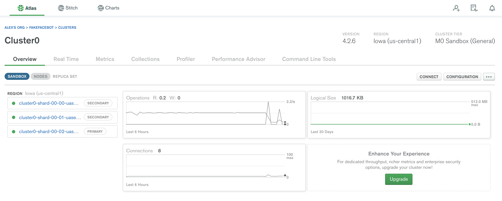

# fake-face-bot
This project is example how you can use Telegram bot API to make your application.
As example quiz-bot for fake and real faces.
## Technologies
* Java
* Spring Boot
* Spring Data
* MongoDB

## Infrastructure
MongoDB Cluster

Heroku hosting

## Web UI
[fake-face-bot UI](https://fakefacebot.herokuapp.com/)

## Telegram
Bot [@fakefacequizbot](https://t.me/fakefacequizbot)
 

## Just Try
Visit web UI with below link to Heroku:
[fake-face-bot UI](https://fakefacebot.herokuapp.com/)
 
Find the bot in Telegram client and start the quiz!
[@fakefacequizbot](https://t.me/fakefacequizbot)